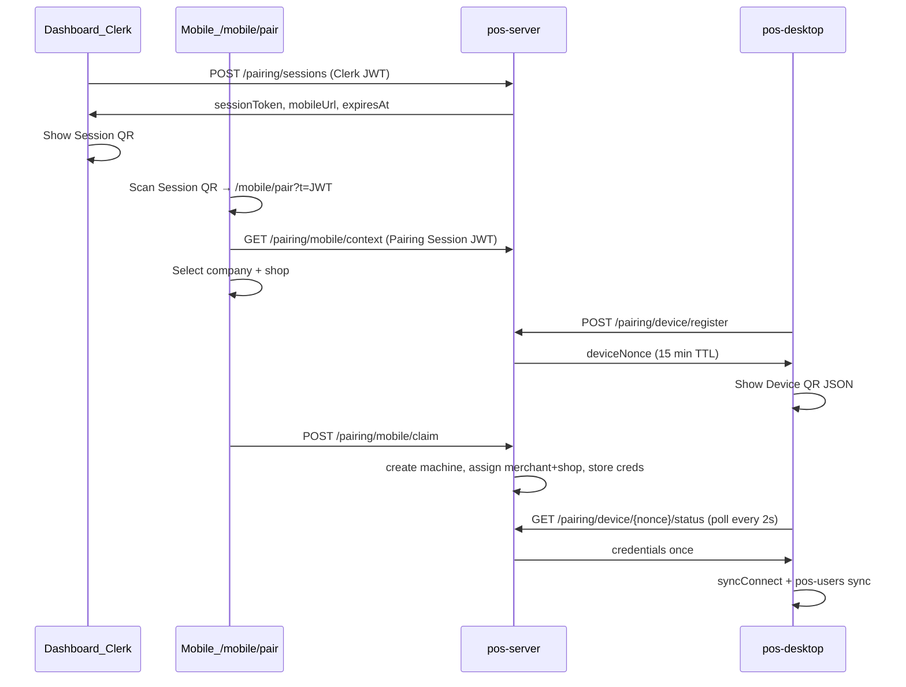

# POS Pairing — Implementation Reference

> **Status (2026-06):** Implemented in code; **not fully end-to-end tested** by the team yet. Use this doc to resume work, debug, or extend pairing.

This document covers **all pairing flows** in the POS platform: legacy 8-char codes, dashboard pre-assign, and **mobile QR bulk install**. It spans **pos-server** (this repo) and **pos-desktop** (sibling repo).

---

## Overview: three ways to pair a till

| Flow | Who acts | Best for |
|------|----------|----------|
| **A. Legacy pairing code** | Distributor generates code in dashboard → operator types code on POS | Fallback, no phone |
| **B. Pre-assign on code** | Same as A, but code stores `companyId` + `shopId` → auto-assign on validate | Single machine, known shop |
| **C. Mobile QR bulk install** | Dashboard starts 12h session → phone scans Session QR → phone scans each POS Device QR | Field install of many tills |

After any successful pair + assign, POS syncs **POS users** via `GET /sync/{machineId}/pos-users` (requires `machine.shop_id` set).

---

## Architecture (flow C — mobile QR)



---

## Credential model

| Token | Issued by | Used by | Scope |
|-------|-----------|---------|-------|
| **Clerk JWT** | Clerk | Dashboard (`client`) | Full admin API |
| **Pairing Session JWT** | `POST /pairing/sessions` | Phone `/mobile/pair` | Mobile pairing endpoints only |
| **Device nonce** | `POST /pairing/device/register` | POS poll + phone claim | Correlates one till; useless alone |
| **Machine JWT** | On pair/claim | POS after pair | Sync, MQTT (`type: machine`) |

### Pairing Session JWT claims

```json
{
  "type": "pairing_session",
  "sub": "<distributor_user_id>",
  "tenant_id": "<tenant_uuid>",
  "jti": "<unique session id>",
  "exp": "<12 hours>"
}
```

- Signed with `JWT_SECRET_KEY` (same as other app JWTs).
- Server validates `jti` against `pairing_sessions` row (not revoked, not expired).
- **No Clerk on phone** — one scan of Session QR is enough for a field day.

### Device QR payload (POS shows)

Compact JSON string (not a URL):

```json
{"v":1,"api":"https://host/api/v1","nonce":"<deviceNonce>","exp":1718790000}
```

Phone parses `nonce` and calls claim API; POS polls status by `nonce`.

---

## Database (Alembic migrations)

| Revision | Purpose |
|----------|---------|
| `c3d4e5f6a7b9` | `pairing_codes.merchant_id`, `pairing_codes.shop_id` (pre-assign on legacy codes) |
| `d4e5f6a7b8c0` | `pairing_sessions`, `device_pairing_requests`, `pos_machines.pairing_session_id` |

### `pairing_sessions`

- `jti`, `distributor_id`, `tenant_id`
- `default_company_id`, `default_shop_id` (updated from mobile)
- `expires_at` (now + 12h), `revoked_at`, `machines_paired_count`
- Unlimited machines per session (counter is audit-only)

### `device_pairing_requests`

- `device_nonce` (128-bit url-safe), `status`: `waiting` → `claimed` → `delivered` | `expired`
- `expires_at` (15 min), `credentials_payload` (JSON, same shape as `/pairing/validate`)
- `pairing_session_id`, `pos_machine_id` set on claim

---

## API endpoints (prefix `/api/v1/pairing`)

### Legacy (unchanged UX, enhanced pre-assign)

| Method | Auth | Path | Notes |
|--------|------|------|-------|
| POST | Clerk distributor | `/generate` | Body: optional `companyId`, `shopId` |
| POST | **Public** | `/validate` | POS sends `code`; creates machine; auto-assigns if code had merchant/shop |
| POST | Clerk distributor | `/machines/{id}/assign` | Manual assign paired → assigned |
| GET | Clerk distributor | `/codes`, `/codes/{id}` | List codes |

### Mobile field install

| Method | Auth | Path | Notes |
|--------|------|------|-------|
| POST | Clerk distributor | `/sessions` | Returns `sessionToken`, `mobileUrl`, `sessionExpireHours: 12` |
| GET | Clerk distributor | `/sessions/active` | Active sessions for polling paired count in dashboard |
| DELETE | Clerk distributor | `/sessions/{id}` | Revoke session |
| GET | Pairing Session JWT | `/mobile/context?companyId=` | Companies + shops for picker |
| PATCH | Pairing Session JWT | `/mobile/session` | Update default company/shop on session |
| POST | Pairing Session JWT | `/mobile/claim` | Body: `deviceNonce`, `companyId`, **`shopId` required** |
| POST | Public (rate limited) | `/device/register` | POS registers; returns `deviceNonce` |
| GET | Public | `/device/{nonce}/status` | Poll: `waiting` or credentials once; then `410 Gone` |

### Rate limits (`server/app/middleware/rate_limit.py`)

- `device/register`: 100/min per IP
- `mobile/claim`: 60/min per session `jti`

---

## Environment variables

**Server** (`server/.env`):

```env
PAIRING_CODE_LENGTH=8
PAIRING_CODE_EXPIRY_MINUTES=15
PAIRING_SESSION_EXPIRE_HOURS=12
DEVICE_PAIRING_NONCE_EXPIRE_MINUTES=15
PAIRING_MOBILE_APP_BASE_URL=http://localhost:3002   # Client origin for Session QR links
JWT_SECRET_KEY=...
```

- **`PAIRING_MOBILE_APP_BASE_URL`**: Base URL of the **Next.js client** (not the API). Used to build `mobileUrl`:
  - `{PAIRING_MOBILE_APP_BASE_URL}/mobile/pair?t={sessionToken}`
- For phone testing over ngrok: set this to your ngrok URL (e.g. `https://xxxx.ngrok-free.app`) and restart API.

**Client** (`client/.env.local`):

```env
NEXT_PUBLIC_API_URL=http://localhost:8000/api/v1
```

Mobile page uses `NEXT_PUBLIC_API_URL` for API calls; Session QR URL comes from server `mobileUrl`.

**POS desktop**: `cloud_api_base` in SQLite settings / onboarding API URL field (must reach API, e.g. `http://localhost:8000/api/v1` or LAN IP).

---

## Key source files

### pos-server

| Area | Path |
|------|------|
| Legacy pairing service | `server/app/services/pairing.py` |
| Mobile pairing service | `server/app/services/pairing_mobile.py` |
| Legacy routes | `server/app/routers/pairing.py` |
| Mobile routes | `server/app/routers/pairing_mobile.py` |
| Pairing session auth | `server/app/middleware/auth.py` → `get_pairing_session_user()` |
| Session JWT creation | `server/app/services/auth.py` → `create_pairing_session_token()` |
| Dashboard machines UI | `client/src/app/dashboard/machines/page.tsx` (field install dialog + legacy code dialog) |
| Mobile pair page | `client/src/app/mobile/pair/` (public route, no Clerk) |
| Mobile API client | `client/src/lib/pairingSessionApi.ts` |
| Public middleware | `client/src/middleware.ts` → `/mobile/pair(.*)` |
| Tests | `server/tests/test_pairing_mobile.py`, `server/tests/test_pairing_preassign.py` |

### pos-desktop (separate repo: `../pos-desktop`)

| Area | Path |
|------|------|
| HTTP helpers | `electron/cloudPairing.ts` (`postDeviceRegister`, `getDevicePollStatus`) |
| IPC | `electron/main.ts` → `cloud-device-register`, `cloud-device-poll-status` |
| Onboarding QR mode | `src/components/onboarding/OnboardingScreen.tsx` (default: scan from phone; fallback: pairing code) |
| Poll interval | **Every 2 seconds** while waiting → explains log spam on `/device/{nonce}/status` |

---

## UX flows

### Dashboard — התקנה מהירה בשטח

1. Distributor logged in (Clerk) → **מכשירים** → **התקנה מהירה בשטח**
2. **התחל התקנה** → `POST /pairing/sessions`
3. Show Session QR + “תוקף 12 שעות” + paired counter (polls `/sessions/active`)
4. **סיום התקנה** → `DELETE /sessions/{id}`

### Phone — `/mobile/pair`

1. Scan Session QR (or open `mobileUrl`)
2. Token stored in `sessionStorage`; `?t=` stripped from URL
3. Pick company + shop
4. **סרוק QR מהקופה** → camera → confirm → `POST /mobile/claim`
5. Repeat for each till; can change company/shop anytime

### POS — onboarding step 1

1. Default tab: **סריקה מהטלפון**
2. `cloudDeviceRegister` → show Device QR
3. Poll `cloudDevicePollStatus` every **2s** until credentials
4. `syncConnect` → auto `posUsersSyncNow`
5. Fallback tab: **קוד התאמה** (legacy)

---

## Machine lifecycle / sync

```
UNPAIRED → (validate/claim) → PAIRED → (assign) → ASSIGNED
```

- **POS users sync** (`server/app/routers/sync.py`): returns `users: []` if `machine.shop_id` is null.
- Pre-assign (flow B or C claim) sets `shop_id` at assign time → sync works if `pos_users` exist for that shop.
- Common bug: pairing without shop → empty user sync (see troubleshooting).

---

## Security notes

| Risk | Mitigation |
|------|------------|
| Stolen Session QR | 12h TTL; revoke from dashboard; scoped JWT; UI warns not to screenshot-share |
| Guessed device nonce | ~128 bits; 15 min TTL; rate limits |
| Claim without auth | `/mobile/claim` requires Pairing Session JWT |
| Wrong shop | `shopId` required on claim; confirm sheet on phone |
| Credential replay on poll | One-time delivery; second poll → 410 Gone |
| Pairing session JWT on dashboard routes | Rejected in `get_current_user()` with clear 401 |

**Not implemented (future):** rate limit on public `/pairing/validate`; E2E encrypt creds to POS; shorten machine JWT TTL.

---

## Deployment checklist

1. Run migrations: `cd server && poetry run python -m alembic upgrade head` (head includes `d4e5f6a7b8c0`)
2. Set `PAIRING_MOBILE_APP_BASE_URL` to reachable client URL (ngrok/production)
3. Restart **API** after code deploy (pre-assign bug was “old server ignored body” — same class of issue)
4. Rebuild/restart **client** (`npm run dev` port 3002 by default)
5. Rebuild **pos-desktop** for QR onboarding + new IPC
6. CORS: client origin in `CORS_ORIGINS` if API and client differ

---

## Troubleshooting

### Many `GET /pairing/device/{nonce}/status` in logs

**Expected.** POS polls every 2s while waiting for phone claim (~30 req/min per till). Stops after successful pair or leaving QR mode.

### Sync returns 0 POS users

1. Check `GET /machines/me` → `shopId` must be non-null (`assigned`).
2. Confirm `pos_users` rows exist for **that exact** `shop_id` in dashboard.
3. Legacy: pairing code may have been generated before pre-assign deploy → `merchant_id`/`shop_id` null on code row.

### Session QR opens but mobile says invalid link

- Token missing/expired/revoked
- Regenerate session from dashboard
- Check `PAIRING_MOBILE_APP_BASE_URL` matches URL phone can reach

### Phone claim fails

- POS nonce expired (15 min) → refresh QR on POS
- Session expired (12h) → new dashboard session
- Company/shop not owned by distributor (RBAC)

---

## Tests

```bash
cd server
poetry run python -m pytest tests/test_pairing_mobile.py tests/test_pairing_preassign.py -q
```

---

## Related work in same branch (non-pairing)

This branch may also include **tenant/merchant SKU sequences**, product `globalSku` UI, and other catalog changes — see git history and migrations `a1b2c3d4e5f7`, `b2c3d4e5f6a8`.

---

## Resume checklist for next LLM / developer

- [ ] E2E test flow C: dashboard session → phone scan → POS QR → login on till
- [ ] Verify ngrok/`PAIRING_MOBILE_APP_BASE_URL` for real phone
- [ ] Confirm pos-desktop changes committed in `pos-desktop` repo
- [ ] Consider reducing poll interval or log noise for `/device/.../status`
- [ ] Optional: warn on dashboard if selected shop has 0 POS users
- [ ] Optional: auto-sync users on pair (collapse onboarding step 2)
